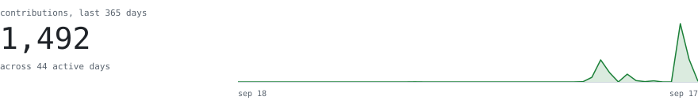
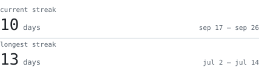
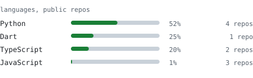
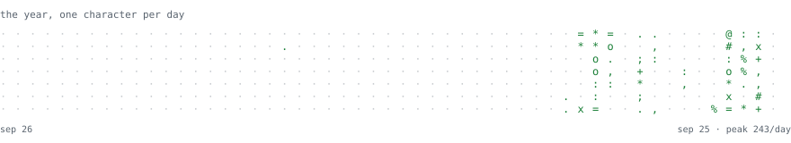

<picture>
  <source media="(prefers-color-scheme: dark)" srcset="assets/portrait-dark.svg">
  
</picture>

## Yash

> Local-first software, mostly. I like problems where the boring answer is 
> a hosted API and the interesting one is a box in my own room.
>
> First-year B.Tech at Lovely Professional University.

<picture>
  <source media="(prefers-color-scheme: dark)" srcset="assets/h-building-dark.svg">
  
</picture>

**[ManhwaManiacs](https://github.com/yash-dhanda/ManhwaManiacs)** — a reader platform that keeps every page on 
hardware you own. Real multi-user auth with per-profile isolation, and 
web, Android and iOS all ship out of one repository. 
<samp>python · fastapi · flutter · docker · caddy</samp>

**[recall](https://github.com/yash-dhanda/recall)** — turns course PDFs into flashcards it verifies before you 
ever see them, then schedules them against a model of how you actually 
forget rather than a fixed interval. 
<samp>python · sqlite · llm</samp>

**[Elizabeth](https://github.com/yash-dhanda/neiro)** — a voice companion that runs on my laptop and hears 
*how* you sound, not just what you said. Prosody is scored against your own 
baseline and one emotional state drives both her voice and her face. 
<samp>python · pytorch · faster-whisper · kokoro · fastapi</samp>

<picture>
  <source media="(prefers-color-scheme: dark)" srcset="assets/h-activity-dark.svg">
  
</picture>

<picture>
  <source media="(prefers-color-scheme: dark)" srcset="assets/hero-dark.svg">
  
</picture>

<picture>
  <source media="(prefers-color-scheme: dark)" srcset="assets/streak-dark.svg">
  
</picture>
<picture>
  <source media="(prefers-color-scheme: dark)" srcset="assets/langs-dark.svg">
  
</picture>

<picture>
  <source media="(prefers-color-scheme: dark)" srcset="assets/year-dark.svg">
  
</picture>

<samp>Every graphic on this page is drawn by <a href="tools/">this repository</a> and refreshed nightly. 
No third-party services, nothing that can rate-limit or go dark.</samp>
